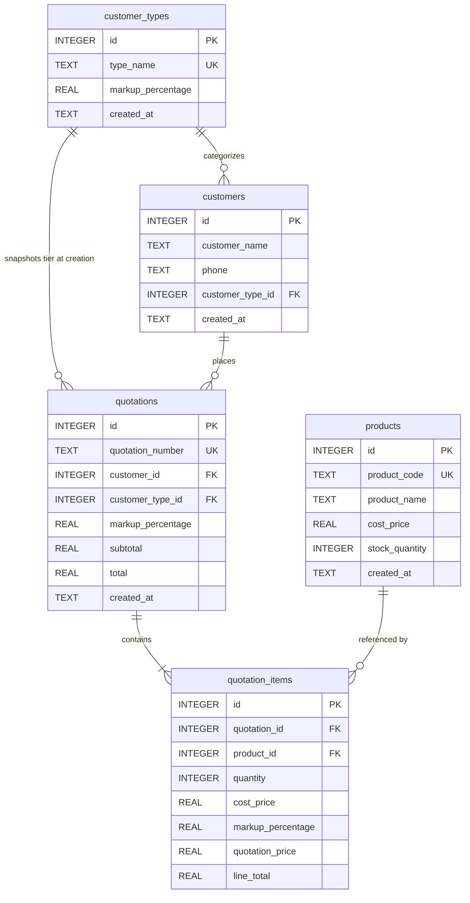
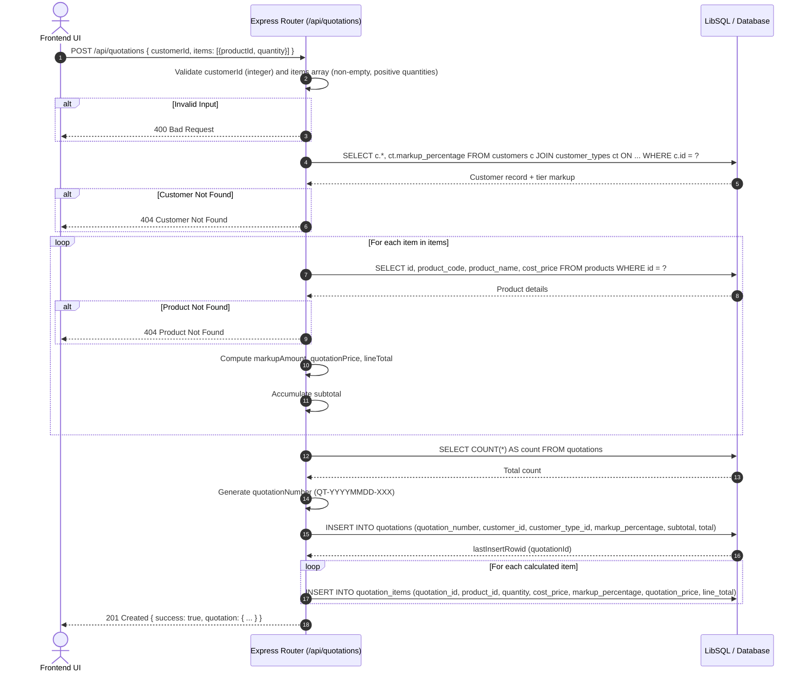
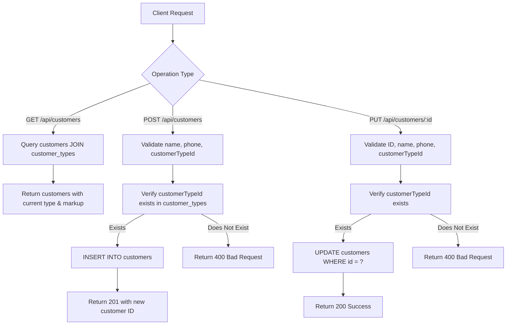
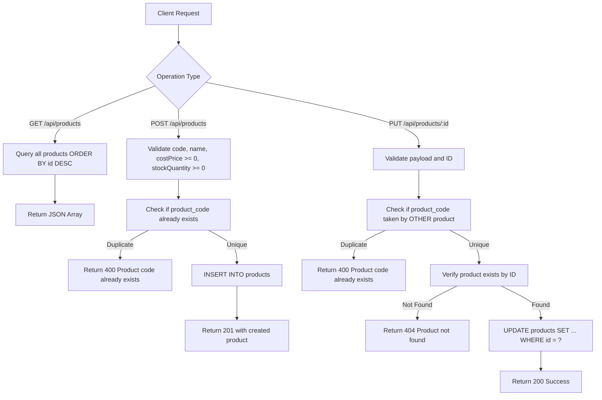

# QuoteFlow: System Architecture & Project Understanding

A comprehensive technical reference and flow documentation for the **QuoteFlow** quotation and billing management system.

---

## 1. Executive Overview

**QuoteFlow** is a specialized B2B/B2C quotation and billing management application. It enables businesses to manage customers, track inventory/products, configure customer tier markups, and rapidly generate dynamic quotations with automated price calculations.

### Core Value Proposition
- **Automated Tiered Pricing:** Eliminates manual calculations by dynamically computing markups based on customer classification (e.g., Type A = 3%, Type E = 30%).
- **Historical Snapshotting:** Locks prices, markup percentages, and cost calculations into historical records at the moment a quote is generated, ensuring future price or tier changes do not alter past quotes.
- **Fast Quotation Generation:** Interactive builder with real-time price preview and instant sequential quotation numbering (`QT-YYYYMMDD-XXX`).

---

## 2. System Architecture

QuoteFlow uses a decoupled client-server architecture:

```
+-------------------------------------------------------------------------+
|                              FRONTEND                                   |
|   React 19 + TypeScript + Vite + Tailwind CSS v4 + Lucide Icons         |
|   Port: http://localhost:5173                                           |
+------------------------------------+------------------------------------+
                                     |
                         HTTP / REST API (JSON)
                         CORS Enabled
                                     |
+------------------------------------v------------------------------------+
|                              BACKEND                                    |
|   Express 5 (ESM) + TypeScript (tsx)                                    |
|   Port: http://localhost:3000                                           |
|   - Request Validation                                                  |
|   - Pricing Engine & Quotation ID Generator                             |
|   - Database Query Abstraction                                          |
+------------------------------------+------------------------------------+
                                     |
                           LibSQL Protocol / SQL
                                     |
+------------------------------------v------------------------------------+
|                              DATABASE                                   |
|   LibSQL Client (@libsql/client)                                        |
|   - Turso Cloud Database (Production) OR                                |
|   - Local SQLite File (Development / Offline)                           |
+-------------------------------------------------------------------------+
```

### Technology Stack Summary

| Layer | Technologies | Purpose |
|---|---|---|
| **Frontend** | React 19, TypeScript, Vite 8, Tailwind CSS v4, Lucide React | Single-page UI, live pricing calculator, dashboard, and modals |
| **Backend** | Node.js, Express 5, TypeScript (`tsx`), CORS, Dotenv | RESTful API endpoints, request validation, business rules |
| **Database** | LibSQL (`@libsql/client`), Turso Cloud / SQLite | Relational persistence with foreign keys and auto-incrementing IDs |

---

## 3. Database Schema & Data Models

The persistence layer consists of 5 relational tables:



### Table Definitions & Key Attributes

#### 1. `customer_types`
Defines customer tiers and their corresponding baseline markup percentages.
- `id`: Primary key (autoincrement).
- `type_name`: Unique name (e.g., `Type A`, `Type B`, `Type C`, `Type D`, `Type E`).
- `markup_percentage`: Floating point markup rate (e.g., `3.0`, `10.0`, `30.0`).
- `created_at`: Creation timestamp.

#### 2. `customers`
Stores client details and links each client to a pricing tier.
- `id`: Primary key (autoincrement).
- `customer_name`: Name or company name.
- `phone`: Contact telephone number.
- `customer_type_id`: Foreign Key referencing `customer_types(id)`.
- `created_at`: Creation timestamp.

#### 3. `products`
Inventory and catalog table.
- `id`: Primary key (autoincrement).
- `product_code`: Unique SKU/identifier (e.g., `PROD001`).
- `product_name`: Descriptive item title.
- `cost_price`: Base acquisition/manufacturing cost.
- `stock_quantity`: On-hand quantity available.
- `created_at`: Creation timestamp.

#### 4. `quotations`
Master quotation header record.
- `id`: Primary key (autoincrement).
- `quotation_number`: Unique sequential formatted number (`QT-YYYYMMDD-XXX`).
- `customer_id`: Foreign Key referencing `customers(id)`.
- `customer_type_id`: Historical snapshot of customer tier.
- `markup_percentage`: Historical snapshot of markup percentage applied.
- `subtotal`: Aggregate before taxes/discounts.
- `total`: Final payable total.
- `created_at`: Creation timestamp.

#### 5. `quotation_items`
Individual line items linked to a parent quotation.
- `id`: Primary key (autoincrement).
- `quotation_id`: Foreign Key referencing `quotations(id)`.
- `product_id`: Foreign Key referencing `products(id)`.
- `quantity`: Quantity quoted.
- `cost_price`: Cost price snapshot at time of quotation.
- `markup_percentage`: Markup percentage snapshot applied.
- `quotation_price`: Computed unit price (`cost_price + markup`).
- `line_total`: Computed line aggregate (`quotation_price * quantity`).

---

## 4. Core Business Logic & Pricing Engine

### The Pricing Calculation Formula

For each product item $i$ in a quotation:

$$\text{markupAmount}_i = \text{costPrice}_i \times \left(\frac{\text{markupPercentage}}{100}\right)$$

$$\text{quotationPrice}_i = \text{costPrice}_i + \text{markupAmount}_i$$

$$\text{lineTotal}_i = \text{quotationPrice}_i \times \text{quantity}_i$$

$$\text{subtotal} = \sum_{i=1}^{n} \text{lineTotal}_i$$

$$\text{total} = \text{subtotal} \quad \text{(V1 baseline)}$$

#### Concrete Calculation Example:
- **Customer:** Jane Doe (`customer_type_id`: Type C = 10% markup)
- **Item 1:** Industrial Valve (`cost_price`: $100.00, `quantity`: 2)
  - $\text{markupAmount} = \$100.00 \times 0.10 = \$10.00$
  - $\text{quotationPrice} = \$100.00 + \$10.00 = \$110.00$
  - $\text{lineTotal} = \$110.00 \times 2 = \$220.00$
- **Item 2:** Flange Gasket (`cost_price`: $20.00, `quantity`: 5)
  - $\text{markupAmount} = \$20.00 \times 0.10 = \$2.00$
  - $\text{quotationPrice} = \$20.00 + \$2.00 = \$22.00$
  - $\text{lineTotal} = \$22.00 \times 5 = \$110.00$
- **Total Quotation Amount:** $\$220.00 + \$110.00 = \$330.00$

### Quotation Number Generation Strategy
Quotations use a predictable business sequence:
1. Current date formatted as `YYYYMMDD` (e.g. `20260926`).
2. Current count of records in `quotations` table incremented by 1:
   $$\text{quotationCount} = (\text{COUNT(*) FROM quotations}) + 1$$
3. Formatted with 3-digit zero padding:
   $$\text{quotationNumber} = \text{"QT-"} + \text{YYYYMMDD} + \text{"-"} + \text{padStart}(\text{quotationCount}, 3, \text{'0'})$$
   *Example:* `QT-20260926-001`, `QT-20260926-002`.

---

## 5. Backend Application Flows (In-Depth)

The backend Express application (`server/src/index.ts`) handles 6 core operational flows:

```
                                Backend Flows
                                      |
     +----------------+---------------+----------------+----------------+
     |                |               |                |                |
1. Quotation     2. Customer     3. Product       4. Customer      5. Database
   Creation         CRUD           CRUD             Tier Admin        Health Check
```

---

### Flow 1: Quotation Creation Flow (Primary Workflow)

This is the most critical flow in the application. It processes raw customer IDs and product line requests, validates existence, applies tier pricing, snapshots prices, and saves both master and child records.



#### Step-by-Step Flow Explanation:
1. **Request Payload Ingestion:** Frontend sends `POST /api/quotations` with `customerId` and an array of `{ productId, quantity }`.
2. **Structural Validation:**
   - Checks if `customerId` is an integer.
   - Checks that `items` is a non-empty array with positive integer quantities.
3. **Customer & Tier Resolution:**
   - Queries `customers` joined with `customer_types`.
   - Extracts customer's associated `customer_type_id` and active `markup_percentage`.
4. **Line-by-Line Item Processing:**
   - Queries `products` for each `productId`.
   - Validates existence (aborts with 404 if any item does not exist).
   - Calculates `markupAmount`, `quotationPrice`, `lineTotal`.
   - Aggregates running `subtotal`.
5. **Sequential Identifier Assignment:**
   - Obtains quotation count from database.
   - Formats unique ID: `QT-YYYYMMDD-XXX`.
6. **Master Record Insertion:**
   - Inserts header into `quotations` and obtains `lastInsertRowid`.
7. **Child Items Insertion:**
   - Inserts each calculated line item into `quotation_items` with snapshot pricing.
8. **Response:**
   - Returns 201 response with complete quotation details.

---

### Flow 2: Customer Management Flow



---

### Flow 3: Product Catalog & Inventory Flow



---

### Flow 4: Customer Tier & Dynamic Markup Adjustment

- **`GET /api/customer-types`**: Returns all 5 default customer tiers (`Type A` through `Type E`) and their respective markup percentages.
- **`PUT /api/customer-types/:id`**: Allows administrators to adjust the markup percentage for any tier.
  - Validates `id` is an integer and `markup >= 0`.
  - Executes `UPDATE customer_types SET markup_percentage = ? WHERE id = ?`.
  - Automatically impacts future quotes for all customers in that tier, while past quotes remain locked due to historical snapshotting.

---

### Flow 5: Quotation History & Audit Flow

- **`GET /api/quotations`**:
  - Queries `quotations` joined with `customers`.
  - Selects `id`, `quotation_number`, `customer_id`, `customer_name`, `phone`, `subtotal`, `total`, and `created_at`.
  - Orders results by `q.id DESC` (most recent first).
  - Populates the Quotation History data table on the frontend.

---

### Flow 6: Database Connectivity Test

- **`GET /api/test-db`**:
  - Executes `SELECT 1 AS connected`.
  - Returns connection confirmation message or 500 error if credentials/database unreachable.

---

## 6. Complete API Specification

| Route | Method | Request Body | Response (Success) | Status Codes | Description |
|---|---|---|---|---|---|
| `/api/test-db` | `GET` | *None* | `{ success: true, message, result }` | 200, 500 | Health check for Turso/SQLite DB |
| `/api/customer-types` | `GET` | *None* | `[ { id, type_name, markup_percentage } ]` | 200, 500 | Fetch all customer tiers |
| `/api/customer-types/:id` | `PUT` | `{ markup: number }` | `{ success: true, customerType }` | 200, 400, 500 | Update markup percentage for tier |
| `/api/customers` | `GET` | *None* | `[ { id, customer_name, phone, customer_type_id, type_name, markup_percentage } ]` | 200, 500 | List all customers with tier details |
| `/api/customers` | `POST` | `{ customerName, phone, customerTypeId }` | `{ success: true, customer }` | 201, 400, 500 | Create a new customer |
| `/api/customers/:id` | `PUT` | `{ customerName, phone, customerTypeId }` | `{ success: true, message }` | 200, 400, 500 | Update customer details |
| `/api/products` | `GET` | *None* | `[ { id, product_code, product_name, cost_price, stock_quantity } ]` | 200, 500 | List all products in catalog |
| `/api/products` | `POST` | `{ productCode, productName, costPrice, stockQuantity }` | `{ success: true, product }` | 201, 400, 500 | Add new product (checks unique code) |
| `/api/products/:id` | `PUT` | `{ productCode, productName, costPrice, stockQuantity }` | `{ success: true, message }` | 200, 400, 404, 500 | Update product details |
| `/api/quotations` | `POST` | `{ customerId: number, items: [ { productId, quantity } ] }` | `{ success: true, quotation }` | 201, 400, 404, 500 | Compute pricing & generate new quote |
| `/api/quotations` | `GET` | *None* | `[ { id, quotation_number, customer_id, customer_name, phone, subtotal, total, created_at } ]` | 200, 500 | Fetch quotation history |

---

## 7. Frontend Architecture & UI Flows

The frontend is implemented in `src/App.tsx` as a responsive Single Page Application (SPA).

### Main Navigation Pages
1. **Dashboard:** KPI summary cards showing count of customers, products, and customer types, with quick links.
2. **Customers:** Data table with customer list, tier tags, and interactive Add/Edit modal dialogs.
3. **Products:** Inventory catalog showing codes, cost prices, stock quantities, and Add/Edit modal dialogs.
4. **Customer Types:** Tier matrix displaying Type A–E with their respective markup rates, allowing direct edits.
5. **Quotations:** 
   - **Interactive Quote Generator:** Customer selection dropdown, multi-item line builder with live unit price, markup calculation, and line total preview.
   - **Quotation History Table:** Audit trail of generated quotations with dates, numbers, customer names, and final totals.
6. **Settings:** Application settings and connection state placeholder.

### Frontend Calculation Synchronization
The frontend mirrors the backend's pricing formula in real-time within the UI before submission, allowing users to see exact markups, unit prices, and running totals as they select products and adjust quantities.

---

## 8. Database Setup & Initialization Scripts

The project includes standalone setup scripts in `server/src/` to initialize tables and seed baseline data:

| Script | Command | Purpose |
|---|---|---|
| `server/src/setup-db.ts` | `npx tsx server/src/setup-db.ts` | Creates `customer_types` table and seeds default tiers (Type A: 3%, B: 5%, C: 10%, D: 20%, E: 30%) |
| `server/src/setup-customers.ts` | `npx tsx server/src/setup-customers.ts` | Creates `customers` table with foreign key to `customer_types` |
| `server/src/setup-products.ts` | `npx tsx server/src/setup-products.ts` | Creates `products` table with unique constraint on `product_code` |
| `server/src/setup-quotations.ts` | `npx tsx server/src/setup-quotations.ts` | Creates `quotations` and `quotation_items` tables with relational foreign keys |

---

## 9. Recommendations & Architectural Enhancements

1. **Transactional Integrity (`db.transaction`):**
   - In `POST /api/quotations`, the insertion of the master quotation and subsequent loop of `quotation_items` should be wrapped in a database transaction. If any item insertion fails, the master quotation should roll back.
2. **Automatic Stock Deduction / Reservation:**
   - In the current implementation, generating a quotation does not decrement `products.stock_quantity`. If quote confirmation or conversion into an order occurs, an inventory decrement step should be added.
3. **Flexible Database Configuration (`server/src/db.ts`):**
   - Provide a fallback to local SQLite (`url: process.env.TURSO_DATABASE_URL || 'file:quoteflow.db'`) so new developers can run the server locally without requiring remote cloud credentials.
4. **Environment Variables for Frontend API URL:**
   - Replace hardcoded `http://localhost:3000` in `src/App.tsx` with `import.meta.env.VITE_API_URL || 'http://localhost:3000'` to facilitate deployment across staging and production environments.
